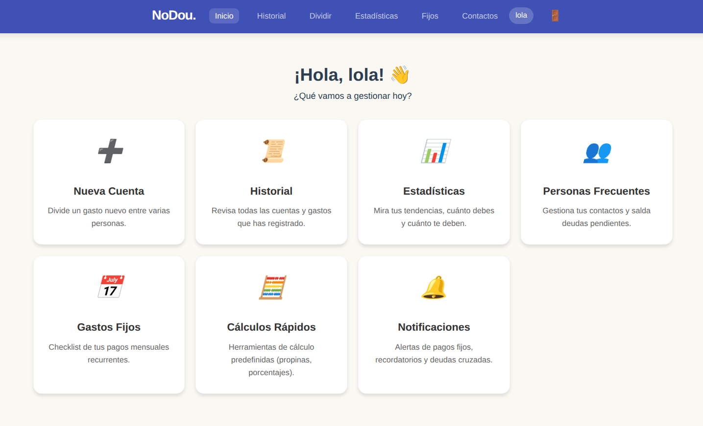
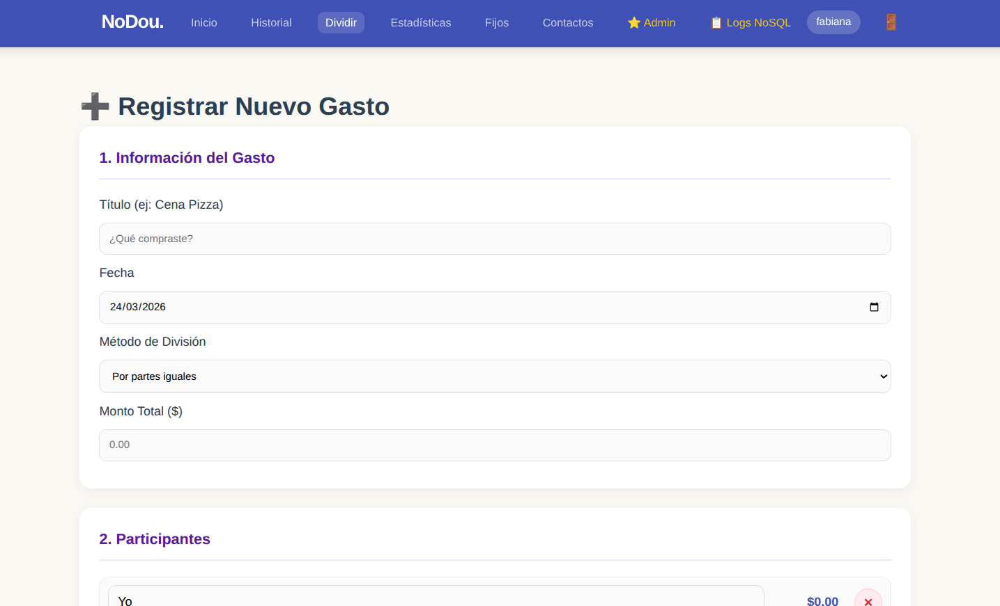
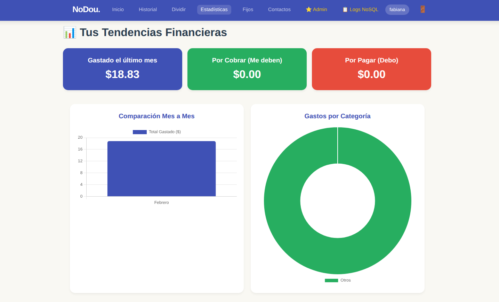
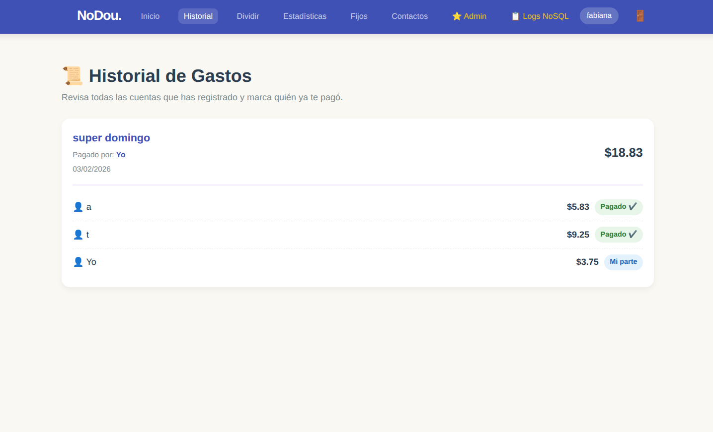

# NoDou

**NoDou** es una app web para dividir y organizar gastos entre amigos, pareja o compañeros de trabajo. Registra transacciones, asigna pagos por persona o por artículo, y lleva el balance al día sin complicaciones.

Demo en vivo → *(próximamente)*

---

## Características

- **3 métodos de división:** a partes iguales, por porcentaje, o artículo por artículo
- **Historial completo:** quién pagó qué y quién debe a quién, con estado pagado/pendiente
- **Estadísticas visuales:** gráficas mensuales y balance general con Chart.js
- **Gastos fijos:** alquiler, suscripciones y recurrentes con alertas de vencimiento
- **Centro de notificaciones:** deudas pendientes y gastos fijos por vencer en un solo lugar
- **Dark mode** y soporte bilingüe (español / inglés)
- **Panel de administración** con visor de logs de actividad
- Diseño responsive adaptado a móvil y escritorio

---

## Stack

| Capa | Tecnología |
|------|-----------|
| Frontend | HTML5, CSS3, JavaScript (Vanilla), Chart.js |
| Backend | PHP 8.2 |
| Base de datos | MySQL |
| Testing | PHPUnit |

---

## Capturas

| Panel principal | Dividir gastos |
|:-:|:-:|
|  |  |
| **Estadísticas** | **Historial** |
|  |  |

---

## Instalación local

### Requisitos
- PHP 8.0+
- MySQL 5.7+
- Composer (solo si quieres correr los tests)

### Pasos

1. Clona el repositorio:
   ```bash
   git clone https://github.com/fabianasoti/NoDou.git
   cd NoDou
   ```

2. Importa el esquema de base de datos:
   ```bash
   mysql -u root -p < sql/nodou_db.sql
   ```

3. Configura las variables de entorno. Copia el ejemplo y edita con tus credenciales:
   ```bash
   cp .env.example .env
   # edita .env con tu editor preferido
   ```
   O bien exporta las variables directamente en tu terminal:
   ```bash
   export DB_HOST=localhost
   export DB_USER=nodou
   export DB_PASS=tu_contraseña
   export DB_NAME=nodou
   ```

4. Levanta el servidor local apuntando a la carpeta `Proyecto/`:
   ```bash
   php -S localhost:8000 -t Proyecto
   ```

5. Abre `http://localhost:8000` en tu navegador.

---

## Deploy en Railway

1. Sube el proyecto a GitHub.
2. En [railway.app](https://railway.app), crea un nuevo proyecto y añade:
   - Un servicio **PHP** conectado al repo.
   - Un plugin **MySQL**.
3. En Variables de entorno del servicio PHP, añade `DB_HOST`, `DB_USER`, `DB_PASS` y `DB_NAME` con los valores que Railway genera para el plugin MySQL.
4. Railway detecta el `nixpacks.toml` automáticamente y usa `Proyecto/` como web root.
5. En el plugin MySQL, importa el esquema desde `sql/nodou_db.sql`.

---

## Tests

```bash
cd Proyecto
composer install
./vendor/bin/phpunit tests/
```

---

## Autora

**Fabiana Victoria Sotillo** — estudiante de DAM
- Portafolio: [fabianasoti.github.io/Portafolio](https://fabianasoti.github.io/Portafolio/)
- GitHub: [@fabianasoti](https://github.com/fabianasoti)
- LinkedIn: [fabianasotillo](https://www.linkedin.com/in/fabianasotillo/)
